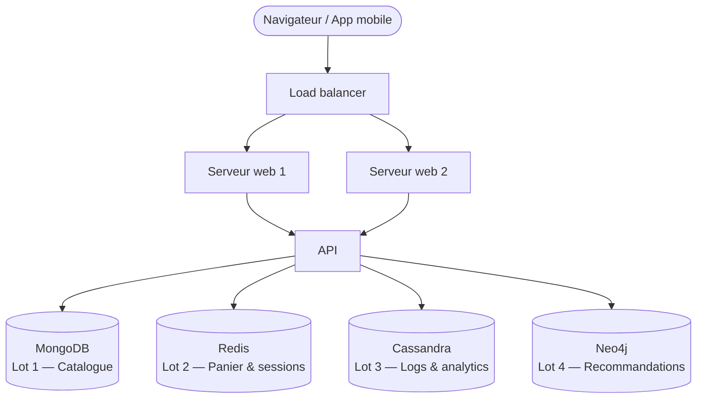

# Test — diagramme Mermaid

Diagramme écrit en texte, rendu directement par GitHub.
Édition : modifier le bloc ci-dessous (aperçu sur https://mermaid.live ou dans l'aperçu Markdown de VS Code).

```mermaid
flowchart TB
    Client([Navigateur / App mobile])
    LB[Load balancer]
    Web1[Serveur web 1]
    Web2[Serveur web 2]
    API[API]

    Mongo[(MongoDB<br/>Lot 1 — Catalogue)]
    Redis[(Redis<br/>Lot 2 — Panier & sessions)]
    Cass[(Cassandra<br/>Lot 3 — Logs & analytics)]
    Neo[(Neo4j<br/>Lot 4 — Recommandations)]

    Client --> LB
    LB --> Web1 & Web2
    Web1 & Web2 --> API
    API --> Mongo
    API --> Redis
    API --> Cass
    API --> Neo
```
